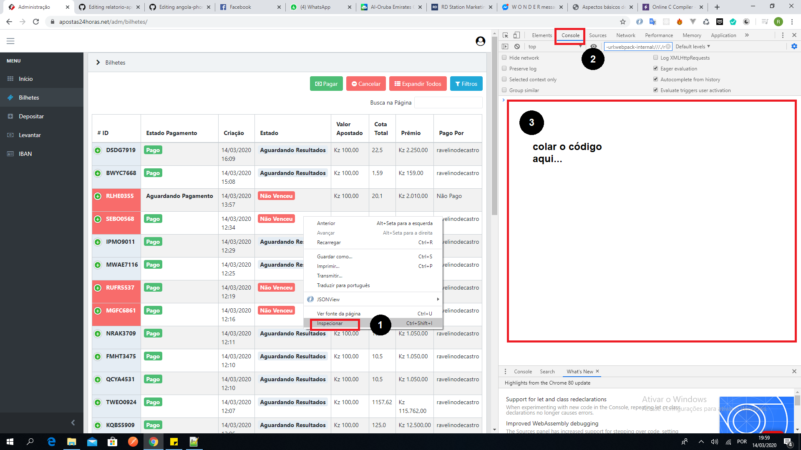

## Como conseguir ver o relatório financeiro das minhas apostas?
Primeiramente devo informar que este algoritmo foi criado a princípio para o site Aposta 24 Horas, para o código funcionar terá de ter o site aberto no computador (recomendado Google Chrome ou Mozzila Firefox), ter a sessão da sua conta iniciada e finalmente estar dentro da página do Painel de Controle, [Clica aqui para ir na página Painel de Controle](https://apostas24horas.net/adm/bilhetes/).

E vamos para a resposta, para obter o relatório financeiro das suas apostas, terá de executar este algoritmo abaixo dentro do seu navegador com a página aberta na página do Painel de controle, para esse efeito, de um clique direito no meio da página, em seguida vai até inspecionar, logo após disso irá abrir uma coisa parecida:



Copie o código e cola na ´área do console, conforme ilustrada na imagem e prima enter.

```javascript
let tickets = document.getElementById("ticket_table").tBodies[0].rows;
let wrapper = document.getElementById("ticket_table_wrapper");
let total_invested = 0;
let total_won = 0;
let total_loose = 0;

for(var i=0;i<tickets.length;i++){

total_invested +=  parseFloat(tickets[i].getElementsByTagName("td")[4].innerHTML.replace(/\.|\Kz/g, ""));
if (tickets[i].getElementsByTagName("td")[3].getElementsByTagName("span")[0].innerHTML== "Venceu, Ganhador Pago"){
total_won  +=  parseFloat(tickets[i].getElementsByTagName("td")[6].innerHTML.replace(/\.|\Kz/g, ""));
}
else if (tickets[i].getElementsByTagName("td")[3].getElementsByTagName("span")[0].innerHTML== "Não Venceu"){
total_loose  +=  parseFloat(tickets[i].getElementsByTagName("td")[4].innerHTML.replace(/\.|\Kz/g, ""));
}

}
function formatMoney(amount, decimalCount = 2, decimal = ",", thousands = ".") {
      try {
        decimalCount = Math.abs(decimalCount);
        decimalCount = isNaN(decimalCount) ? 2 : decimalCount;

        const negativeSign = amount < 0 ? "-" : "";

        let i = parseInt(
          (amount = Math.abs(Number(amount) || 0).toFixed(decimalCount))
        ).toString();
        let j = i.length > 3 ? i.length % 3 : 0;

        return (
          negativeSign +
          (j ? i.substr(0, j) + thousands : "") +
          i.substr(j).replace(/(\d{3})(?=\d)/g, "$1" + thousands) +
          (decimalCount
            ? decimal +
              Math.abs(amount - i)
                .toFixed(decimalCount)
                .slice(2)
            : "")
        );
      } catch (e) {
        console.log(e);
      }
    }
wrapper.insertAdjacentHTML('beforeend', `<div>Investimento: ${formatMoney(total_invested)} Kz</div><div>Total ganho: ${formatMoney(total_won)} Kz</div><div>Total perdido: ${formatMoney(total_loose)} Kz</div><div>NOTA: este algoritimo foi por <a href="https://github.com/ravelinodecastro">Ravelino de Castro </a>, especialmente para o site Aposta 24 horas, e ela só mostra as estátisticas das últimos 30 apostas.`);
```

---
## Nota
Esse algorito foi criado utilizando a linguagem de programação Javascript e ela funcionou correctamente na versão do site Aposta 24 Horas testado no dia 14 de Março de 2020.

## Doação
Se você acho útil este algoritmo e queiras agradecer, podes fazer a sua doação.

## Paypal: ravelinodecastro@gmail.com

## País: Angola

Banco: Millenium Atlantico

IBAN: AO06 0040 0000 1812 7588 1016 5

Nº da conta: 1181275810001

SWIFT: BAIPAPLU


## País: Portugal

Banco: Atlantico Europa

IBAN: PT50 0189 0002 5934 7512 0017 5

Nº da conta: 259347510001

SWIFT: BAPAPTPL
